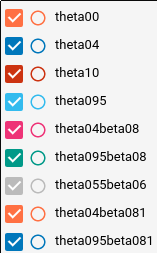

# deep GAN
[]()

deep GAN experiment.

### Main idea
Multiple generators cooperate to improve generative ability under the competitive selection of one discriminator

# Requirement
* tensorflow
* numpy

# Usage
Ensure your system is installed with Git and clone this reposity with command line:

```
$ git clone https://github.com/naturomics/deepGAN.git
```
``cd deepGAN `` and edit file 'main.py' to suit your configure.

Then, start to run with command line:
```
$ python main.py
```

# Results

## Training Loss
Experiments were carried out with different hyper parameters **theta** and **beta**

The legend for various hyper parameters(theta00 meaning theta=0.0 and no using beta, theta04beta08 i.e. theta=0.4 and beta=0.8, etc.):


d1 total loss:


d2 total loss:


d loss with g1 as fake input:


d loss with g2 as fake input:


g1 loss:


g2 loss:

